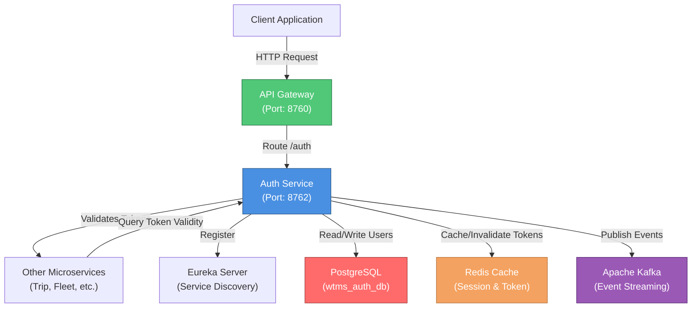
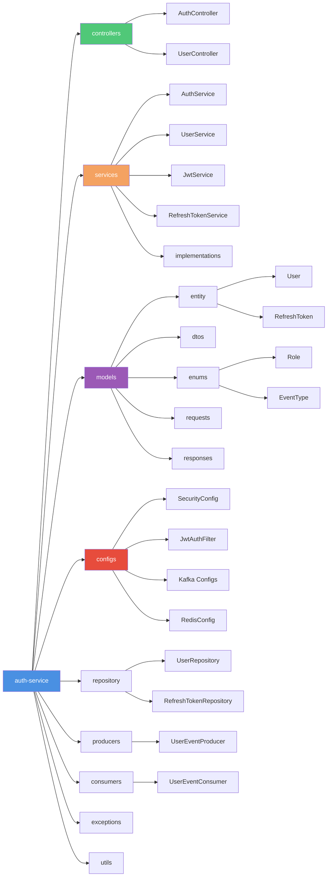
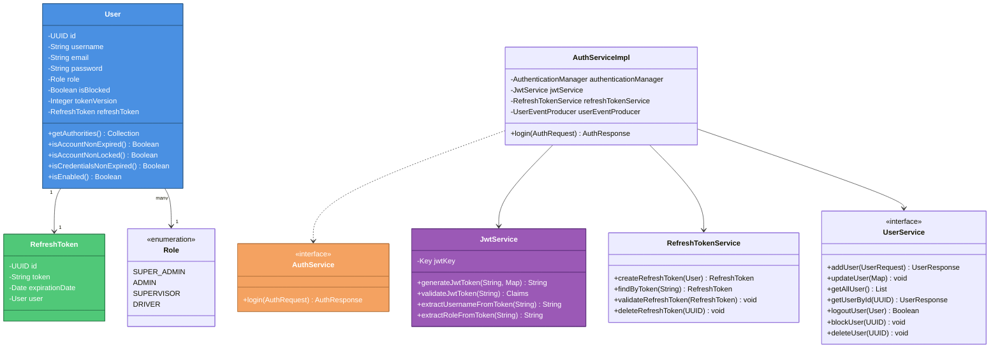

# Auth Service - WTMS (Waste Transport Management System)

## Service Overview

The **Auth Service** is the core security and authentication microservice within the WTMS ecosystem. It is responsible for managing user credentials, issuing JSON Web Tokens (JWT), validating authentication requests, and enforcing role-based access control across all microservices in the platform.

### Key Responsibilities

- **User Authentication**: Validates user credentials and issues access and refresh tokens
- **Token Management**: Generates, validates, and refreshes JWT tokens with role-based claims
- **User Management**: Provisions and manages user accounts with role-based access control
- **Session Management**: Tracks user sessions, implements logout functionality, and invalidates tokens
- **Event Publishing**: Publishes user-related events (registration, updates, deletions) via Apache Kafka
- **Security**: Enforces Spring Security filters and method-level access control
- **Token Caching**: Leverages Redis for high-performance token validation and session caching

### Business Context

In the WTMS microservice architecture, the Auth Service acts as a **security gateway**, ensuring that all user requests across other services (Trip Service, Fleet Service, Tracking Service, etc.) are properly authenticated and authorized. It follows a **centralized authentication pattern** where all security decisions are made and validated by this service.

---

## Architecture & Design

### High-Level Architecture Diagram



### Package Diagram (Internal Structure)



### Class Diagram (Core Domain Model)



---

## Setup & Execution

### Prerequisites

Ensure the following services and tools are installed and running on your machine:

- **Java Development Kit (JDK)**: Version 17 or higher
- **Apache Maven**: Version 3.8.1 or higher
- **PostgreSQL**: Version 13+ (for user database storage)
- **Apache Kafka**: Version 3.0+ (for event streaming)
- **Redis**: Version 6.0+ (for session and token caching)
- **Eureka Server**: Running on `http://localhost:8761/eureka/` (for service discovery)

### Step 1: Clone the Repository

```bash
git clone <repository-url>
cd BackEnd/auth-service
```

### Step 2: Configure Environment Variables

Update `src/main/resources/application.properties` with your environment-specific values:

```properties
# Database Configuration
spring.datasource.url=jdbc:postgresql://localhost:5432/wtms_auth_db
spring.datasource.username=admin
spring.datasource.password=your_strong_password

# JWT Configuration
jwt.private-key.path=file:D:/path/to/private_key.pem
jwt.public-key.path=classpath:certs/public_key.pem
app.security.internal-secret=your_secret_key

# Kafka Configuration
kafka.bootstrap.server=localhost:9092
kafka.consumer.group=auth-group

# Redis Configuration
spring.data.redis.host=localhost
spring.data.redis.port=6379
spring.data.redis.database=0

# Eureka Configuration
eureka.client.service-url.defaultZone=http://localhost:8761/eureka/
```

### Step 3: Generate JWT Key Pair (if not present)

Generate RSA keys for JWT signing and verification:

```bash
# Generate private key
openssl genrsa -out private_key.pem 2048

# Generate public key
openssl rsa -in private_key.pem -pubout -out public_key.pem

# Place public_key.pem in src/main/resources/certs/
```

### Step 4: Build the Service

```bash
# Clean and build with Maven
mvn clean install

# Or skip tests for faster build
mvn clean install -DskipTests
```

### Step 5: Run the Service Locally

```bash
# Option 1: Using Maven Spring Boot plugin
mvn spring-boot:run

# Option 2: Run the generated JAR
java -jar target/auth-service-0.0.1-SNAPSHOT.jar
```

### Step 6: Verify the Service

Once the service is running, verify its status:

```bash
# Health Check
curl -X GET http://localhost:8762/actuator/health

# Ping Endpoint (requires valid JWT token)
curl -X GET http://localhost:8762/auth/ping \
  -H "Authorization: Bearer <your_jwt_token>"

# Check Eureka Registration
curl -X GET http://localhost:8761/eureka/apps/auth-service
```

### Default Port Configuration

| Service | Port | Description |
|---------|------|-------------|
| Auth Service | `8762` | Authentication & Authorization |
| Eureka Server | `8761` | Service Discovery |
| Kafka | `9092` | Event Streaming |
| PostgreSQL | `5432` | User Database |
| Redis | `6379` | Cache & Session Storage |

---

## Environment Variables & Application Properties

### Required Configuration Table

| Property | Type | Default | Description | Example |
|----------|------|---------|-------------|---------|
| `spring.application.name` | String | `auth-service` | Microservice identifier | `auth-service` |
| `server.port` | Integer | `8762` | HTTP server port | `8762` |
| `spring.datasource.url` | String | Required | PostgreSQL connection URL | `jdbc:postgresql://localhost:5432/wtms_auth_db` |
| `spring.datasource.username` | String | Required | Database username | `admin` |
| `spring.datasource.password` | String | Required | Database password (strong) | `your_strong_password` |
| `spring.jpa.hibernate.ddl-auto` | String | `update` | Schema generation strategy | `update` / `create` / `validate` |
| `jwt.private-key.path` | String | Required | Path to RSA private key (PEM) | `file:D:/path/private_key.pem` |
| `jwt.public-key.path` | String | Required | Path to RSA public key (PEM) | `classpath:certs/public_key.pem` |
| `app.security.internal-secret` | String | Required | Internal API secret key (minimum 32 chars) | `yK8!pL3@xQ7#dT9$wF2^sR5&vM1*bN6(` |
| `kafka.bootstrap.server` | String | Required | Kafka broker address | `localhost:9092` |
| `kafka.consumer.group` | String | `auth-group` | Kafka consumer group ID | `auth-group` |
| `spring.data.redis.host` | String | Required | Redis server hostname | `localhost` |
| `spring.data.redis.port` | Integer | `6379` | Redis server port | `6379` |
| `spring.data.redis.database` | Integer | `0` | Redis database number | `0` |
| `eureka.client.register-with-eureka` | Boolean | `true` | Register service with Eureka | `true` |
| `eureka.client.service-url.defaultZone` | String | Required | Eureka server URL | `http://localhost:8761/eureka/` |
| `eureka.instance.prefer-ip-address` | Boolean | `true` | Use IP address instead of hostname | `true` |
| `management.tracing.sampling.probability` | Float | `1.0` | Distributed tracing sample rate (0.0-1.0) | `1.0` |
| `logging.level.org.hibernate.SQL` | String | `DEBUG` | Hibernate SQL logging level | `DEBUG` / `INFO` |
| `spring.jpa.show-sql` | Boolean | `false` | Print SQL statements to console | `false` / `true` |

### Security Properties

```properties
# Spring Security Configuration
spring.security.filter.order=5
spring.security.require-ssl=false

# CORS Configuration (if needed)
# spring.web.cors.allowed-origins=*
# spring.web.cors.allowed-methods=GET,POST,PUT,DELETE

# Actuator Endpoints (Monitoring)
management.endpoints.web.exposure.include=health,metrics,info
management.endpoint.health.show-details=always
```

---

## API Endpoints

### Authentication Endpoints

| HTTP Method | Endpoint | Role Required | Description | Request Body | Response |
|-------------|----------|---------------|-------------|--------------|----------|
| `POST` | `/auth/login` | Public | Authenticate user and issue tokens | `{ "username": "string", "password": "string" }` | `{ "accessToken": "JWT", "refreshToken": "JWT" }` |
| `POST` | `/auth/refresh` | Authenticated | Refresh access token using refresh token | `{ "refreshToken": "string" }` | `{ "accessToken": "JWT", "refreshToken": "JWT" }` |
| `GET` | `/auth/logout` | Authenticated | Invalidate user session and tokens | None | HTTP 200 OK |
| `GET` | `/auth/ping` | Authenticated | Verify authentication status | None | `{ "statusCode": "int", "message": "string" }` |

### User Management Endpoints

| HTTP Method | Endpoint | Role Required | Description | Request Body | Response |
|-------------|----------|---------------|-------------|--------------|----------|
| `POST` | `/auth/user/add` | `SUPER_ADMIN`, `ADMIN` | Create a new user account | `{ "username": "string", "email": "string", "password": "string", "role": "enum", "name": "string", "phoneNo": "string", ... }` | `{ "id": "UUID", "username": "string", "email": "string", "role": "string" }` |
| `PATCH` | `/auth/user/update` | `ADMIN` | Update existing user information | `{ "userId": "UUID", "field": "value" }` | HTTP 204 No Content |
| `GET` | `/auth/user/all` | `ADMIN` | Retrieve all users in the system | None | `[ { "id": "UUID", "username": "string", ... } ]` |
| `POST` | `/auth/user/by-id` | Authenticated | Retrieve specific user by ID | `{ "userId": "UUID" }` | `{ "id": "UUID", "username": "string", ... }` |
| `PATCH` | `/auth/user/block` | `ADMIN` | Block a user account | `{ "userId": "UUID" }` | HTTP 204 No Content |
| `DELETE` | `/auth/user/delete` | `ADMIN` | Delete a user account permanently | `{ "userId": "UUID" }` | HTTP 204 No Content |

### Health & Monitoring Endpoints

| HTTP Method | Endpoint | Description | Response |
|-------------|----------|-------------|----------|
| `GET` | `/actuator/health` | Service health status | `{ "status": "UP/DOWN", "components": {...} }` |
| `GET` | `/actuator/metrics` | Application metrics | Micrometer metrics |
| `GET` | `/swagger-ui.html` | OpenAPI (Swagger) documentation | Interactive API documentation |

### Example API Requests

#### Login Request
```bash
curl -X POST http://localhost:8762/auth/login \
  -H "Content-Type: application/json" \
  -d '{
    "username": "driver_001",
    "password": "SecurePassword123!"
  }'
```

#### Refresh Token Request
```bash
curl -X POST http://localhost:8762/auth/refresh \
  -H "Content-Type: application/json" \
  -d '{
    "refreshToken": "eyJhbGciOiJSUzI1NiIsInR5cCI6IkpXVCJ9..."
  }'
```

#### Create User Request (Admin Only)
```bash
curl -X POST http://localhost:8762/auth/user/add \
  -H "Content-Type: application/json" \
  -H "Authorization: Bearer <admin_access_token>" \
  -d '{
    "username": "new_driver",
    "email": "driver@example.com",
    "password": "SecurePassword123!",
    "role": "DRIVER",
    "name": "John Doe",
    "phoneNo": "0333-1234567",
    "cnic": "12345-6789012-3",
    "address": "123 Main Street",
    "dob": "1990-01-15",
    "licenseNo": "DL-2024-00123"
  }'
```

---

## Test Cases & Documentation

### Core Test Scenarios

| Scenario ID | Category | Scenario Description | Input Parameters | Expected Output | Validation Type |
|-------------|----------|----------------------|-------------------|------------------|-----------------|
| **AUTH-TC-001** | Authentication | Successful user login with valid credentials | username: `admin_001`, password: `AdminPass123!` | HTTP 200, accessToken & refreshToken issued | Integration Test |
| **AUTH-TC-002** | Authentication | Login failure with invalid username | username: `nonexistent_user`, password: `Password123!` | HTTP 401 Unauthorized, "User not found" | Integration Test |
| **AUTH-TC-003** | Authentication | Login failure with incorrect password | username: `admin_001`, password: `WrongPassword` | HTTP 401 Unauthorized, "Invalid credentials" | Integration Test |
| **AUTH-TC-004** | Authentication | Login blocked user account | username: `blocked_user`, password: `Password123!` | HTTP 403 Forbidden, "User account is blocked" | Integration Test |
| **AUTH-TC-005** | Token Management | Successful token refresh with valid refresh token | refreshToken: `valid_refresh_token` | HTTP 200, new accessToken issued | Integration Test |
| **AUTH-TC-006** | Token Management | Refresh token failure with expired token | refreshToken: `expired_token` | HTTP 401 Unauthorized, "Refresh token expired" | Integration Test |
| **AUTH-TC-007** | Token Management | Refresh token failure with invalid signature | refreshToken: `tampered_token` | HTTP 401 Unauthorized, "Invalid token" | Integration Test |
| **AUTH-TC-008** | Session | Successful logout and token invalidation | accessToken: `valid_token` | HTTP 200, token invalidated in Redis | Integration Test |
| **AUTH-TC-009** | Session | Ping endpoint with valid JWT token | accessToken: `valid_token` | HTTP 200, "User authenticated" message | Integration Test |
| **AUTH-TC-010** | Session | Ping endpoint with expired JWT token | accessToken: `expired_token` | HTTP 401 Unauthorized, "Token expired" | Integration Test |
| **USER-TC-001** | User Management | Create new user with valid data (Admin) | UserRequest: all required fields valid | HTTP 200, user created with UUID, event published to Kafka | Integration Test |
| **USER-TC-002** | User Management | Create user with duplicate username | UserRequest: existing username | HTTP 409 Conflict, "Username already exists" | Integration Test |
| **USER-TC-003** | User Management | Create user with invalid email format | UserRequest: email = `invalid_email` | HTTP 400 Bad Request, "Invalid email format" | Unit Test |
| **USER-TC-004** | User Management | Create user with insufficient permission (Supervisor) | role: `SUPERVISOR`, request: create user | HTTP 403 Forbidden, "Insufficient permissions" | Unit Test |
| **USER-TC-005** | User Management | Retrieve all users (Admin only) | Admin role JWT token | HTTP 200, list of all users with metadata | Integration Test |
| **USER-TC-006** | User Management | Retrieve all users (Non-admin) | Driver role JWT token | HTTP 403 Forbidden, "Access denied" | Unit Test |
| **USER-TC-007** | User Management | Get user by ID (valid UUID) | userId: `valid-uuid` | HTTP 200, user details returned | Integration Test |
| **USER-TC-008** | User Management | Get user by ID (invalid UUID) | userId: `nonexistent-uuid` | HTTP 404 Not Found, "User not found" | Integration Test |
| **USER-TC-009** | User Management | Update user information (Admin) | userId: `uuid`, updates: `{ "email": "new@example.com" }` | HTTP 204 No Content, user updated, event published | Integration Test |
| **USER-TC-010** | User Management | Block user account (Admin) | userId: `driver-uuid` | HTTP 204 No Content, user blocked, login prevented | Integration Test |
| **USER-TC-011** | User Management | Delete user account (Admin) | userId: `uuid` | HTTP 204 No Content, user soft-deleted, event published | Integration Test |
| **USER-TC-012** | Validation | Create user with invalid phone format | UserRequest: phoneNo = `12345` (invalid pattern) | HTTP 400 Bad Request, "Phone format invalid" | Unit Test |
| **USER-TC-013** | Validation | Create user without required field | UserRequest: missing `name` field | HTTP 400 Bad Request, "Name is required" | Unit Test |
| **USER-TC-014** | Authorization | Access /auth/user/all without authentication | No Authorization header | HTTP 401 Unauthorized | Unit Test |
| **KAFKA-TC-001** | Event Publishing | Verify user creation event published | UserRequest: valid data | Kafka message received in `user-events` topic with type: `USER_REGISTERED` | Integration Test |
| **KAFKA-TC-002** | Event Publishing | Verify user update event published | Update user via PATCH /auth/user/update | Kafka message received with type: `USER_UPDATED` | Integration Test |
| **KAFKA-TC-003** | Event Consumption | Process user event from other services | UserEvent consumed from Kafka | User entity updated/synced in Auth Service | Integration Test |
| **CACHE-TC-001** | Redis Caching | Token validation cached in Redis | Valid access token used | Subsequent validations use cached token claims | Integration Test |
| **CACHE-TC-002** | Redis Caching | Invalidate token cache on logout | User logout request | Token removed from Redis cache | Integration Test |

### Running Tests

```bash
# Run all tests
mvn test

# Run specific test class
mvn test -Dtest=AuthServiceApplicationTests

# Run tests with coverage
mvn clean test jacoco:report

# View coverage report
# Open target/site/jacoco/index.html in browser
```

### Test Dependencies

The project includes the following testing frameworks:

```xml
<dependency>
    <groupId>org.springframework.boot</groupId>
    <artifactId>spring-boot-starter-test</artifactId>
    <scope>test</scope>
</dependency>
```

---

## Key Components & Their Roles

### Security & Authentication

- **JwtAuthFilter**: Intercepts HTTP requests, validates JWT tokens, and populates Spring Security context
- **SecurityConfig**: Configures Spring Security filters, authentication providers, and authorized endpoints
- **JwtService**: Generates and validates JWT tokens using RSA keys, extracts claims
- **UserDetailsServiceImpl**: Custom UserDetails provider for Spring Security authentication

### Data Persistence

- **User Entity**: Represents user account with roles and authentication details
- **RefreshToken Entity**: Manages refresh token lifecycle with expiration validation
- **UserRepository**: Spring Data JPA repository for User entity queries
- **RefreshTokenRepository**: Spring Data JPA repository for RefreshToken queries

### Business Logic

- **AuthService**: Orchestrates login flow, delegates to UserDetailsService and JwtService
- **UserService**: Manages user CRUD operations, sends events to Kafka
- **RefreshTokenService**: Manages refresh token creation, validation, and expiration
- **UserEventProducer**: Publishes user-related events to Kafka (`user-events` topic)

### Event Streaming

- **UserEventConsumer**: Listens to user events from other services (Kafka)
- **UserEventProducer**: Publishes CREATE, UPDATE, DELETE events when user operations occur
- **EventType**: Enum defining event types (USER_REGISTERED, USER_UPDATED, USER_DELETED, USER_BLOCKED)

### Caching & Performance

- **RedisConfig**: Configures Spring Data Redis for session and token caching
- **Token Validation**: Tokens cached in Redis to reduce JWT parsing overhead
- **Session Invalidation**: Logout triggers Redis key deletion for instant token revocation

---

## Monitoring & Observability

### Actuator Endpoints

The service exposes the following monitoring endpoints via Spring Boot Actuator:

```bash
# Health check
curl http://localhost:8762/actuator/health

# Application metrics
curl http://localhost:8762/actuator/metrics

# Trace recent requests
curl http://localhost:8762/actuator/httptrace
```

### Logging Configuration

Logs are configured using Log4j2 (high-performance asynchronous logging):

- **Log File**: `logs/auth-service.log`
- **Log Level**: Configurable per package in `log4j2.xml`
- **Async Appender**: Uses Disruptor for high-throughput logging without blocking

### Distributed Tracing

- **Micrometer Tracing**: Enabled with Brave bridge for distributed tracing
- **Trace ID Propagation**: 100% sampling enabled (`management.tracing.sampling.probability=1.0`)
- **Integration**: Compatible with ELK Stack, Jaeger, or Zipkin

---

## Common Issues & Troubleshooting

### Issue 1: Service Cannot Connect to PostgreSQL

**Symptoms**: `SQLException: Unable to connect to database`

**Solutions**:
```bash
# Verify PostgreSQL is running
psql -U admin -d wtms_auth_db

# Check connection string in application.properties
# Ensure credentials are correct
# Verify firewall allows port 5432
```

### Issue 2: JWT Token Validation Fails

**Symptoms**: `Invalid token` or `JWT signature does not match`

**Solutions**:
```bash
# Verify RSA keys exist and are accessible
ls -la src/main/resources/certs/public_key.pem

# Check private key path in application.properties
# Ensure keys are in correct PEM format
# Regenerate keys if necessary
openssl rsa -in private_key.pem -check
```

### Issue 3: Service Not Registering with Eureka

**Symptoms**: Service not visible in Eureka dashboard

**Solutions**:
```bash
# Verify Eureka server is running on port 8761
curl http://localhost:8761/eureka/apps

# Check application.properties for Eureka URL
# Ensure service name is unique across all services
# Check network connectivity to Eureka server
```

### Issue 4: Kafka Connection Timeout

**Symptoms**: `Failed to connect to Kafka broker`

**Solutions**:
```bash
# Verify Kafka broker is running
jps | grep Kafka

# Check bootstrap server address
# Default: localhost:9092 (local) or broker-address:9092 (docker)

# Verify Kafka topic exists
kafka-topics.sh --list --bootstrap-server localhost:9092
```

### Issue 5: Redis Connection Error

**Symptoms**: `Cannot get Redis connection`

**Solutions**:
```bash
# Verify Redis is running
redis-cli ping  # Should return PONG

# Check Redis connection string in application.properties
# Default port: 6379
# Ensure no password authentication (or add password property)
```

---

## Deployment & Production Checklist

- [ ] Change default passwords in `application.properties`
- [ ] Generate production-grade RSA key pair for JWT
- [ ] Configure external PostgreSQL instance (non-localhost)
- [ ] Configure external Kafka cluster with replication
- [ ] Configure Redis with persistence and replication
- [ ] Enable HTTPS/TLS for all endpoints
- [ ] Configure CORS policies for API Gateway
- [ ] Set up distributed tracing (Jaeger/Zipkin)
- [ ] Enable centralized logging (ELK Stack)
- [ ] Configure health check and alerting
- [ ] Document custom environment variables
- [ ] Set up CI/CD pipeline with automated tests
- [ ] Review and harden Spring Security configurations
- [ ] Implement rate limiting and DDoS protection
- [ ] Regular security audits and dependency updates

---

## Additional Resources

- **Spring Boot Documentation**: https://spring.io/projects/spring-boot
- **Spring Security**: https://spring.io/projects/spring-security
- **Spring Cloud Netflix Eureka**: https://spring.io/projects/spring-cloud-netflix
- **JWT Best Practices**: https://tools.ietf.org/html/rfc7519
- **Kafka Documentation**: https://kafka.apache.org/documentation/
- **Redis Documentation**: https://redis.io/documentation
- **Micrometer Docs**: https://micrometer.io/docs
- **OpenAPI/Swagger**: `/swagger-ui.html`

---

## Contributing & Support

For issues, questions, or contributions:

1. Review the [HELP.md](./HELP.md) file for additional setup guidance
2. Check the inline code comments for implementation details
3. Refer to the Spring Boot logs (`logs/` directory) for debugging
4. Contact the WTMS development team for support

---

**Last Updated**: June 22, 2026  
**Service Version**: 0.0.1-SNAPSHOT  
**Java Version**: 17  
**Spring Boot Version**: 4.0.6
